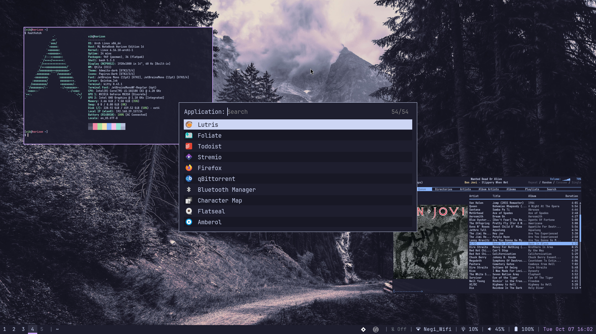

# Managing Config Files

Using GNU `stow` to manage these configuration files.

## Setup

```bash
pacman -S stow
./stow-files
```
## Examples

Here is a little preview of my system.

Lockscreen|Desktop|
:-----------------------------------------------:|:--------------------------------------------------:|
|

## Useful Programs

Install these programs to make the config files work properly.

* `batsignal`: A lightweight battery monitor daemon
* `betterlockscreen` (AUR): A simple, minimal lockscreen
* `brightnessctl`: Lightweight brightness control tool
* `dunst`: Customizable and lightweight notification-daemon
* `fastfetch`: A feature-rich and performance oriented neofetch like system information tool
* `feh`: Fast and light imlib2-based image viewer
* `firefox`: Fast, Private & Safe Web Browser
* `i3lock-color` (AUR): The world's most popular non-default computer lockscreen
* `kitty`: A modern, hackable, featureful, OpenGL-based terminal emulator
* `maim`: Utility to take a screenshot using imlib2
* `mpd`: Flexible, powerful, server-side application for playing music
* `mpv`: A free, open source, and cross-platform media player
* `pamixer`: Pulseaudio command-line mixer like amixer
* `pass`: Stores, retrieves, generates, and synchronizes passwords securely
* `picom`: Lightweight compositor for X11
* `polybar`: A fast and easy-to-use status bar
* `qtile`: A full-featured, pure-Python tiling window manager
* `ranger`: Simple, vim-like file manager
* `redshift`: Adjusts the color temperature of your screen according to your surroundings
* `reflector`: A Python 3 module and script to retrieve and filter the latest Pacman mirror list
* `rmpc`: A beautiful and configurable TUI client for MPD
* `rofi`: A window switcher, application launcher and dmenu replacement
* `stow`: Manage installation of multiple softwares in the same directory tree
* `thunar`: Modern, fast and easy-to-use file manager for Xfce
* `tmux`: Terminal multiplexer
* `vim`: Vi Improved, a highly configurable, improved version of the vi text editor
* `vscodium`-bin (AUR): Binary releases of VS Code without MS branding/telemetry/licensing
* `xidlehook` (AUR): xautolock rewrite in Rust, with a few extra features
* `yt-dlp`: A youtube-dl fork with additional features and fixes
